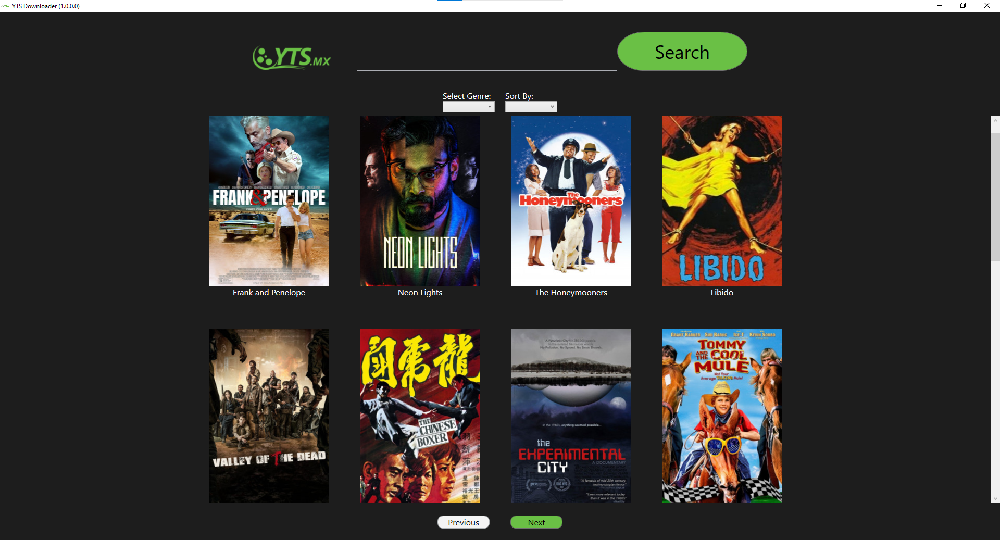

# YTS_Downloader
YTS Desktop Downloader is a windows application that lets you download your favorite movies without opening a browser.

## **Main Application**

## **Genre and Sorting Selection**

## **Search Bar Function**

## **Details and Download**

# Getting Started
In order to run this application:
- [Clone this Repository](https://github.com/Hannes0730/YTS-Downloader.git) or [Download this ZIP file](https://github.com/Hannes0730/YTS-Downloader/archive/refs/heads/master.zip)
- Open Visual Studio, then run **release** to obtain the released application in the current folder.
- Run the **YTS_Downloader.exe** file
  
# License
This project is licensed under the MIT License - see the [LICENSE](LICENSE.txt) file for more details.
